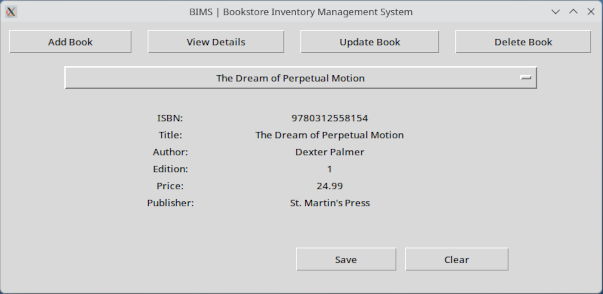

# BIMS

BIMS is a basic GUI inventory management system for cataloguing books. It uses a locally-stored SQLite3 database to perform CRUD actions.

## Installation

First, clone the repo `git clone https://github.com/tristanh-code/bookstore-inventory.git`. Go to the containing folder with `cd`. Run the application with `python app.py` or `python3 app.py` on Mac/Linux.

## Usage

- The four buttons on the top of the window correspond to the action you would like to perform.
- The drop-down menu below is for selecting a book to view or modify.
- Save commits changes to the database.
- Clear empties all fields for the book you are viewing but does not commit any changes.
- You will receive confirmation from a pop-up window when your changes are successful or an error message if they are not.

## Notes

The database bookstore.db comes prepopulated for demo purposes, but you can run `python empty_bookstore_db.py` to remove all records. 
I kept this program super lightweight - no database server, unobtrusive interface. 
So, it looks plain. At some point, I would like to try another approach with a more full-featured GUI using PyQT and maybe use MariaDB in a Docker container.
